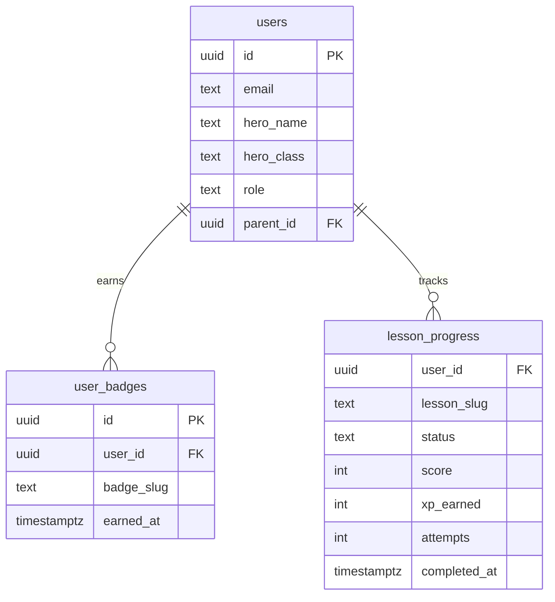

# Realm Badges, Score Tiers, Badge Wall

## Overview

Make progression meaningful. Right now XP and levels are just numbers — nothing unlocks, nothing changes. This batch adds three tightly coupled features: realm badges earned by completing all lessons within a realm, bronze/silver/gold score tiers per lesson, and a visual badge wall on the dashboard.

**Dependency:** Issue #41 (curriculum expansion — 36 lessons across 6 realms) must land first. It introduces the `Realm` type, `realm: number` field on `Lesson`, and `content/realms.ts`. This plan builds on that infrastructure.

## Problem Statement

Kids complete lessons, earn XP, see a number go up. There's no collectible reward, no visual trophy, no reason to retake a lesson they scored poorly on. The progression system has no teeth.

## Proposed Solution

### 1. Realm badges — earned after completing all lessons in a realm

Uses the `Realm` type and `realm: number` on `Lesson` from issue #41. No new category system needed — realms ARE the badge categories.

**Badge earned when ALL lessons in a realm are completed.** With 5-8 lessons per realm, this is a meaningful milestone. As more lessons are added to a realm, the bar rises naturally.

**Badge definitions — derived from `content/realms.ts`:**

```typescript
// lib/badges.ts
// Badge metadata lives alongside realm definitions — each Realm gets a badge.
// No separate badge config needed. Badge slug = realm slug.

import { realms } from "@/content/realms";

export const REALM_BADGES: Record<number, {
  name: string;
  icon: string;
  description: string;
}> = {
  1: { name: "Tower Graduate", icon: "🏰", description: "Completed The Apprentice's Tower" },
  2: { name: "Scribe Initiate", icon: "📜", description: "Mastered The Scribe's Library" },
  3: { name: "Frontend Forger", icon: "🌐", description: "Conquered The Frontend Realm" },
  4: { name: "Dungeon Diver", icon: "⚔️", description: "Survived The Backend Dungeons" },
  5: { name: "Master Artificer", icon: "🔧", description: "Graduated The Artificer's Workshop" },
  6: { name: "Grand Champion", icon: "👑", description: "Completed The Grand Quest" },
};
```

**Realm lesson counts (from #41):**

| Realm | Name | Lessons | Badge earned after |
|-------|------|---------|-------------------|
| 1 | The Apprentice's Tower | 6 | 6 completions |
| 2 | The Scribe's Library | 8 | 8 completions |
| 3 | The Frontend Realm | 7 | 7 completions |
| 4 | The Backend Dungeons | 7 | 7 completions |
| 5 | The Artificer's Workshop | 5 | 5 completions |
| 6 | The Grand Quest | 3 | 3 completions |

**DB table for earned badges:**

```sql
-- supabase/migrations/005_badges.sql
CREATE TABLE public.user_badges (
  id UUID PRIMARY KEY DEFAULT gen_random_uuid(),
  user_id UUID NOT NULL REFERENCES public.users(id) ON DELETE CASCADE,
  badge_slug TEXT NOT NULL,  -- realm slug, e.g., "apprentices-tower"
  realm_id INT NOT NULL,     -- 1-6, matches Realm.id
  earned_at TIMESTAMPTZ NOT NULL DEFAULT now(),
  UNIQUE(user_id, badge_slug)
);

CREATE INDEX idx_user_badges_user ON public.user_badges(user_id);
```

UNIQUE constraint prevents duplicate awards. `realm_id` enables efficient queries.

**Badge check logic — runs after `completeLesson()`:**

```typescript
// lib/badges.ts
export async function checkAndAwardBadges(userId: string): Promise<string[]> {
  // 1. Get all completed lesson slugs for user
  // 2. Group by realm (using lesson.realm field from #41)
  // 3. For each realm where ALL lessons are completed, check if badge exists
  // 4. Insert missing badges
  // 5. Return newly earned badge slugs (for celebration UI)
}
```

### 3. Quiz score tiers — computed, not stored

Score tiers are derived from the existing `lesson_progress.score` column. No schema change needed.

```typescript
// lib/types.ts
export type QuizTier = "gold" | "silver" | "bronze" | null;

export function getQuizTier(score: number | undefined): QuizTier {
  if (score === undefined || score === null) return null;
  if (score >= 95) return "gold";
  if (score >= 85) return "silver";
  if (score >= 70) return "bronze";
  return null;
}
```

**Display locations:**
- Dashboard lesson nodes (`app/page.tsx` LessonNode) — medal icon next to completed lessons
- Parent child detail page (`app/parent/[childId]/page.tsx`) — tier shown per lesson
- Unlock screen (`components/UnlockScreen.tsx`) — tier announcement on completion

**Tier visuals:**

| Tier | Icon | Color |
|---|---|---|
| Gold | 🥇 | `text-gold` |
| Silver | 🥈 | `text-slate-300` |
| Bronze | 🥉 | `text-fire-orange` |
| None (<70%) | — | — |

### 4. Badge wall — new dashboard section

New component inserted between UnlockBanner and Quest Map on the kid dashboard.

```
┌──────────────────────────────────────────┐
│  PlayerHeader (existing)                 │
├──────────────────────────────────────────┤
│  UnlockBanner (existing)                 │
├──────────────────────────────────────────┤
│  ┌─ Realm Badges ─────────────────────┐  │
│  │  🏰      📜      🌐      ⚔️      🔧      👑  │  │
│  │  Tower  Scribe  Front  Dung  Artif Grand │  │
│  │  ✓      3/8     🔒     🔒     🔒     🔒  │  │
│  │                                        │  │
│  │  "1 of 6 realm badges earned"          │  │
│  └────────────────────────────────────────┘  │
├──────────────────────────────────────────┤
│  Quest Map (existing)                    │
└──────────────────────────────────────────┘
```

**Component: `components/BadgeWall.tsx`**

- Grid of 6 badge slots (one per realm, uses `content/realms.ts` + `REALM_BADGES`)
- Earned: glowing icon + realm name + accent color glow, `rpg-card-completed` style
- Unearned: greyed out icon + "X/Y" progress count, `rpg-card-locked` style
- Realm accent colors from #41 (emerald, amber, sky, violet, rose, gold)
- Summary: "X of 6 realm badges earned" at bottom
- Animation: staggered entrance, glow pulse on earned badges
- Tap earned badge → tooltip with badge name + description + date earned
- Tap unearned badge → shows which lessons remain

**Parent view:** Badge wall also shown on child detail page (`app/parent/[childId]/page.tsx`), same component, read-only.

## Technical Approach

### Phase 0: Types + Migration

**Prerequisite:** #41 must be merged — provides `Realm` type, `realm: number` on Lesson, `content/realms.ts`.

**Files to modify:**
- `lib/types.ts` — add `QuizTier`, `getQuizTier()`, `Badge` type, add `badges` to `PlayerProfile`
- `supabase/migrations/005_badges.sql` — `user_badges` table + fix `xp_transactions` CHECK constraint

### Phase 1: Server Logic

**Files to modify:**
- `lib/badges.ts` (new) — `REALM_BADGES` config, `checkAndAwardBadges()`, `getBadgesForUser()`
- `lib/progress.ts` — update `completeLesson()` to call `checkAndAwardBadges()`, update `rowsToProfile()` to include badges, update `loadDashboard()` to fetch badges
- `app/actions/progress.ts` — expose badge data through existing server actions
- `app/actions/users.ts` — update `listChildren()` and `getChildProfileForParent()` to include badges

### Phase 2: Components (parallelizable)

**Files to create:**
- `components/BadgeWall.tsx` — badge grid component
- `components/QuizTierBadge.tsx` — small medal icon component

**Files to modify:**
- `app/page.tsx` — insert BadgeWall, add tier icons to LessonNode
- `app/parent/[childId]/page.tsx` — insert BadgeWall, add tier to lesson rows
- `components/UnlockScreen.tsx` — show tier earned + new badge earned if applicable
- `components/QuizSection.tsx` — show tier on score screen

### Phase 3: Integration + Polish

- Wire badge earn celebration into unlock screen (newly earned badge pops in)
- Audio: use `unlock-celebration` SFX for badge earn
- Animation: immediate state change, 600ms delayed VFX (per learnings doc)
- AnimatePresence with dynamic keys (per learnings doc)

## Acceptance Criteria

### Functional
- [ ] `user_badges` table created via migration 005
- [ ] Completing all lessons in a realm auto-awards the realm badge
- [ ] Badge wall visible on kid dashboard between UnlockBanner and Quest Map
- [ ] Badge wall shows earned/unearned state for all 6 realms with realm accent colors
- [ ] Tapping an earned badge shows badge name, description, date earned
- [ ] Unearned badges show progress ("4 of 6 lessons" remaining)
- [ ] Quiz score tiers (bronze/silver/gold) displayed on completed lesson nodes
- [ ] Score tiers visible on parent child detail page
- [ ] Unlock screen announces tier earned on lesson completion
- [ ] Unlock screen announces new badge earned (if any)
- [ ] Badge persists through parent lesson resets (never revoked)

### Non-Functional
- [ ] Badge check adds <50ms to lesson completion flow
- [ ] Badge wall renders without layout shift on dashboard load
- [ ] Animations respect `prefers-reduced-motion`
- [ ] Mobile responsive — badge grid wraps cleanly on small screens

## Spec-Flow Findings (Critical)

### 1. Score tier thresholds adjusted for variable quiz sizes

Current quizzes have 5 questions (scores: 0/20/40/60/80/100%). Issue #41 introduces boss difficulty scaling: 5 questions (Realm 1-2), 6 (Realm 3-4), 7 (Realm 5-6). With 6 questions, possible scores include 83% and 67%. With 7: 71%, 86%, 100%.

**Decision:** Use thresholds that work across all quiz sizes:

```typescript
export function getQuizTier(score: number | undefined): QuizTier {
  if (score === undefined || score === null) return null;
  if (score >= 100) return "gold";   // perfect score
  if (score >= 80) return "silver";  // 4/5, 5/6, 6/7
  if (score >= 60) return "bronze";  // 3/5, 4/6, 5/7
  return null;
}
```

Gold = perfection (any quiz size). Silver/Bronze achievable at all sizes.

### 2. XP clawback is silently broken (pre-existing bug)

`xp_transactions` has `CHECK (amount > 0)` (migration 001, line 53). The `resetLessonProgress` function calls `award_xp` with a negative amount — this silently fails. Migration 005 should fix this:

```sql
ALTER TABLE public.xp_transactions DROP CONSTRAINT xp_transactions_amount_check;
ALTER TABLE public.xp_transactions ADD CHECK (amount != 0);
```

### 3. Badge revocation on parent reset

**Decision: Badges persist.** Never take away something a kid earned. If a parent resets a lesson, the badge stays. This is kid-friendly and avoids punishment psychology. The badge was legitimately earned — the reset is for learning reinforcement, not punishment.

### 4. Badge-earn celebration on unlock screen

Extend `LessonCompletionResult` to include `newBadges?: { slug: string; name: string; icon: string }[]`. UnlockScreen shows badge pop-in after XP/level/streak when a new badge is earned.

### 5. Badge wall for zero-progress users

Show the wall with all badges locked + motivational message: "Complete lessons to earn badges!" Gives them something to aim for.

### 6. Progress denominator is dynamic

"4/6 lessons" counts from current content files for that realm. When new lessons are added to a realm, the denominator grows. Badge earned = all lessons in realm complete.

## Edge Cases

- **Realm not fully populated yet:** If only 3 of 8 planned Realm 2 lessons exist in content, badge is earned after completing those 3. When more are added, badge persists (grandfathered).
- **Kid completes lesson with <60% score:** No tier shown, lesson still counts as completed for badge progress.
- **Kid retakes lesson and gets higher score:** Tier upgrades automatically (computed from current score in lesson_progress).
- **Kid retakes lesson and gets lower score:** Tier downgrades (reflects current score, not best-ever). This is fine — the reset was intentional.
- **Parent views badge wall for kid:** Read-only, same component.
- **Brand-new user, no progress:** Badge wall visible but all locked, with motivational message.

## Dependencies & Risks

- **Bug fix required:** `CHECK (amount > 0)` on `xp_transactions` must be relaxed in migration 005 to unblock XP clawback on lesson reset (pre-existing bug).
- **Risk:** During content rollout, realms with few lessons make badges too easy. Mitigated by: (a) grandfathering early earners, (b) badge wall shows realm lesson count so it's transparent.
- **Note:** Per memory, user wants Prisma eventually — keep supabase additions minimal. One simple table, one simple query. Easy to migrate later.

## ERD



## References

### Internal
- Dashboard layout: `app/page.tsx:407-410` (badge wall insertion point)
- Lesson types: `lib/types.ts:119-129` (Lesson interface)
- Profile types: `lib/types.ts:145-159` (PlayerProfile)
- Score storage: `lib/progress.ts:168-169` (score written on completion)
- Completion flow: `lib/progress.ts:160-207` (completeLesson)
- Dashboard load: `lib/progress.ts:294-299` (loadDashboard)
- Award XP pattern: `supabase/migrations/004_fixes.sql:21-70` (partial index pattern)
- Parent reset: `app/actions/users.ts:218-271` (resetLessonProgress)
- RPG CSS: `app/globals.css:7-36` (color tokens), `193-221` (rpg-card)
- Animation pattern: `docs/solutions/ui-bugs/boss-battle-hp-desynced-from-answer-flash.md`
- AnimatePresence keys: `docs/solutions/ui-bugs/animate-presence-boolean-toggle-no-retrigger.md`

### Related Issues
- #35 (this batch)
- #41 (prerequisite — curriculum expansion, 36 lessons, 6 realms, Realm type)
- #36 (Batch 2 — interaction logging, depends on this foundation)
- #38 (Batch 4 — realm mastery stars, extends badge system)
